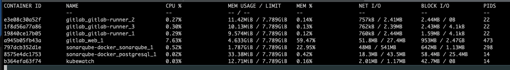
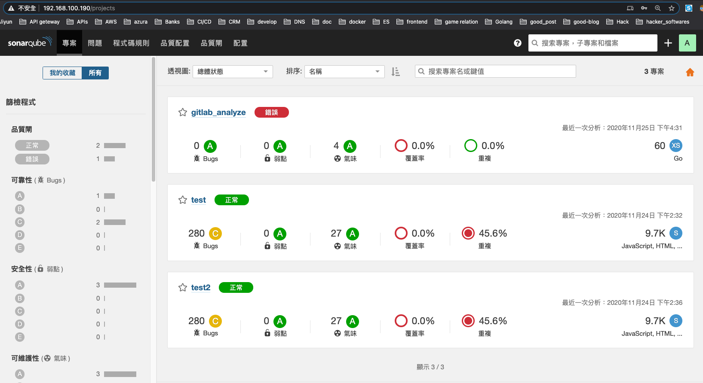
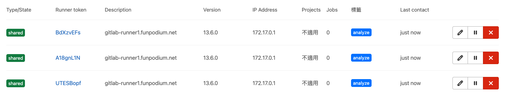
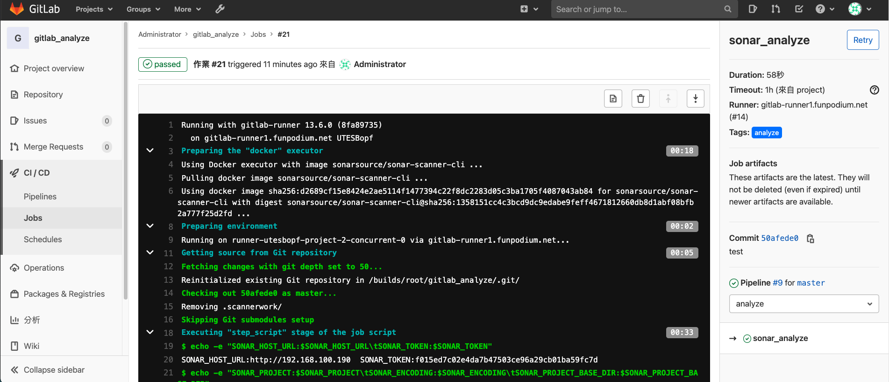
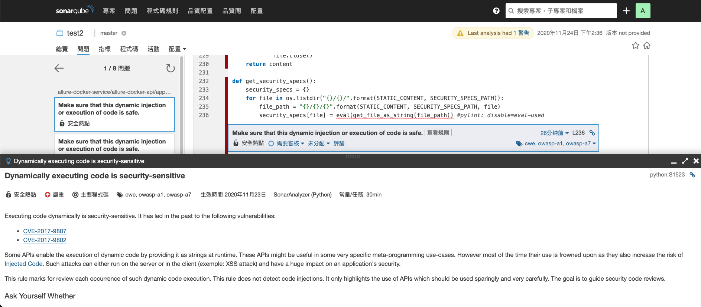

How deploy sonarsource and gitlab combinding.

---
title: 'How deploy sonarsource and gitlab combinding.'
disqus: hackmd
---

Drupal install tome module for making static pages
===


## Table of Contents

[TOC]

## Operator Guide

User story
---

# merge method - not yet.
jenkins + sonarsource
gitlab + sonarsource


Step.1 Pre do for install sonarsource.
---

vim predo.sh
```gherkin=
#!/bin/bash

sysctl -w vm.max_map_count=262144
```
chmod 700 & ./predo.sh

Step.2 Install sonarsource with docker-compose.
---

vim docker-compose.yml
```gherkin=
version: '3.6'

services:
  postgresql:
    image: 'docker.io/bitnami/postgresql:10-debian-10'
    environment:
      - ALLOW_EMPTY_PASSWORD=yes
    volumes:
      - ./postgresql_data:/bitnami/postgresql
  sonarqube:
    image: docker.io/bitnami/sonarqube:7-debian-10
    ports:
      - '80:9000'
    environment:
      - POSTGRESQL_HOST=postgresql
      - POSTGRESQL_ROOT_USER=postgres
      - POSTGRESQL_CLIENT_CREATE_DATABASE_NAME=fp_sonarqube
      - POSTGRESQL_CLIENT_CREATE_DATABASE_USERNAME=fp_sonarqube
      - POSTGRESQL_CLIENT_CREATE_DATABASE_PASSWORD=fp_sonarqube!QAZ2wsx#EDC
      - SONARQUBE_DATABASE_NAME=fp_sonarqube
      - SONARQUBE_DATABASE_USER=fp_sonarqube
      - SONARQUBE_DATABASE_PASSWORD=fp_sonarqube!QAZ2wsx#EDC
      - SONARQUBE_USERNAME=admin
      - SONARQUBE_PASSWORD=!QAZ2wsx#EDC
      - SONARQUBE_PORT_NUMBER=9000
      - SONARQUBE_ELASTICSEARCH_PORT_NUMBER=9001
      - SONARQUBE_WEB_CONTEXT=/
      - SONARQUBE_START_TIMEOUT=300
      # No defaults.
#      - SONARQUBE_CE_JAVA_ADD_OPTS
#      - SONARQUBE_ELASTICSEARCH_JAVA_ADD_OPTS
#      - SONARQUBE_WEB_JAVA_ADD_OPTS
#      - SONARQUBE_PROPERTIES=my.sonar.property1=property_value,my.sonar.property2=property_value
    volumes:
      - ./sonarqube_data:/bitnami
```
docker-compose up -d

Step.3 Install sonarsource modules.
---

sonarsource module install - installed.
```gherkin=
Traditional Chinese Language Pack
YAML Analyzer
SonarPythonLanguages
PMD
Java I18n Rules
GitLab Auth
Checkstyle
Ansible Lint
```

Step.4 Configure the token between sonarqube and gitlab.
---
gitlab sonarqube's Impersonation Token - api only, verified okay.
```gherkin=
5LH3unBdMu5pytrvimbv
```

gitlab -> 管理區塊 -> Applications -> create sonarqube
In your GitLab profile, you need to create a Developer Application for which the 'Authorization callback URL' must be set to '<value_of_sonar.core.serverBaseURL_property>/oauth2/callback/gitlab'.
```gherkin=
http://192.168.100.190/oauth2/callback/gitlab
```
Remember to enable -> Trusted , api

local test
```gherkin=
application id:ffb8c08a70c5dce979801944ebc75ad13b8dd6c20645c3f75065e309e7dbd695
application secret:ff4a449012e1ad491aa943194be0d88ba169bcd282e055db83cd2aad5213900x
```

production setting
```gherkin=
application id:508ba07fdd8c40abccc5160c96c4171f2522072289c4dfe4dfe8054f33b8976c
application secret:cdfc9d43e49ac33bc3c68b9ca2c42bddca6311bee2299afb3ac70d631eb54a2x
```

Step.5 Configure for sonarqube's gitlab-plugin.
---
admin 登录 SonarQube，點擊 配置 —> 通用配置 —> GitLab
設置 -> GitLab url , Application ID , Secret
Gitlab access scope -> api
Default groups -> devops
Synchronize user groups -> enable

local test
```gherkin=
GitLab url: http://192.168.100.190:8080
Application ID:
```

production setting
```gherkin=
GitLab url: http://gitlab.funpodium.net
Application ID: 508ba07fdd8c40abccc5160c96c4171f2522072289c4dfe4dfe8054f33b8976x
```

scanner verified okay. (without /opt/sonar-scanner/conf/sonar-scanner.properties, get SONAR_TOKEN from sonarqube web gui.)

vim scan.sh
```gherkin=
#!/bin/bash

export SONARQUBE_URL="http://192.168.100.190"
export YOUR_REPO="/opt/allure-docker"
export YOUR_CACHE_DIR="sonar_cache"

export SONAR_TOKEN="f015ed7c02e4da7b47503ce96a29cb01ba59fc7d"
export SONAR_PROJECT="test2"
export SONAR_ENCODING="UTF-8"
export SONAR_PROJECT_BASE_DIR="/usr/src"

# run as a non-root container.
docker run \
    --rm \
    --user="$(id -u):$(id -g)" \
    -e SONAR_HOST_URL="${SONARQUBE_URL}"  \
    -e SONAR_SCANNER_OPTS="-Dsonar.projectKey=${SONAR_PROJECT} -Dsonar.sourceEncoding=${SONAR_ENCODING}" \
    -e SONAR_TOKEN="${SONAR_TOKEN}" \
    -e SONAR_PROJECT_BASE_DIR="${SONAR_PROJECT_BASE_DIR}" \
    -v "${YOUR_REPO}:${SONAR_PROJECT_BASE_DIR}" \
    -v "${YOUR_CACHE_DIR}:/opt/sonar-scanner/.sonar/cache" \
    sonarsource/sonar-scanner-cli
    
# backup for use.
#    -e SONAR_SCANNER_OPTS="-Dsonar.projectKey=test -Dsonar.sources=. -Dsonar.login=f015ed7c02e4da7b47503ce96a29cb01ba59fc7d" \
#    -e SONAR_SCANNER_DEBUG_OPTS=""
# --- END --- #
```
chmod 700 scan.sh & ./scan.sh
And then you could get report at SonarQube's dashboard.

Step.6 Configure and install for gitlab-ci runners.
---

vim docker-compose_gitlab_runner.yml
```gherkin=
version: "3.5"

services:

  gitlab-runner:
    #container_name: gitlab-runner
    logging:
      options:
        max-size: "1024k"
        max-file: "10"
    image: 'gitlab/gitlab-runner:latest'
    restart: always
    hostname: 'gitlab-runner1.funpodium.net'
    volumes: ["/opt/gitlab-runner-config:/etc/gitlab-runner:Z", "/var/run/docker.sock:/var/run/docker.sock", "/etc/localtime:/etc/localtime:ro"]

volumes:
  gitlab-runner-config:
```

vim cat start_gitlab_runners.sh
```gherkin=
#!/bin/bash

export gitlab_srv='http://192.168.100.190:8080'
export register_token='abXs3osmzkGpsqCX4msp' # global token for shared
export runner_num='3'
export runner_shell='bash'
export runner_tags='analyze'
export runner_concurrency='1'

### vim /etc/hosts # if u want to fixed the gitlab srv, it will be more faster.

startup_runner()
{
[ "$(docker ps -a|grep -c gitlab-runner)" -ne "0" ] && docker-compose -f docker-compose_gitlab_runner.yml down
sleep 0.5
docker-compose -f docker-compose_gitlab_runner.yml up -d
}

scaling_runner()
{
docker-compose -f docker-compose_gitlab_runner.yml scale gitlab-runner="${runner_num}"
}

register_runner()
{
for i in $(docker ps -a|grep gitlab-runner|awk '{print $NF}')
do
   echo " - registration for ${i}."
   docker exec -it "${i}" gitlab-runner register -n --url "${gitlab_srv}" \
     --registration-token "${register_token}" --clone-url "${gitlab_srv}" \
     --tag-list "${runner_tags}" --locked=false --request-concurrency "${runner_concurrency}" \
     --shell "${runner_shell}" --executor docker --docker-image "docker:latest" --docker-privileged
done
}

startup_runner
scaling_runner
register_runner

# --- END --- #
```

chmod 700 ./start_gitlab_runners.sh
./start_gitlab_runners.sh

And then you should verify the status of gitlab-ci's runners at gitlab web gui.

Step.7 Configure for gitlab-ci.yml.
---
Configure variables at gitlab-ci.yml
According: https://docs.gitlab.com/ee/ci/variables/
```gherkin=
variables:
  TEST: "HELLO WORLD"
```

Verify okay for .gitlab-ci.yml

vim .gitlab-ci.yml
```gherkin=
image: sonarsource/sonar-scanner-cli
variables:
  SONAR_HOST_URL: "http://192.168.100.190"
  SONAR_TOKEN: "f015ed7c02e4da7b47503ce96a29cb01ba59fc7d"
  SONAR_PROJECT: "test2"
  SONAR_ENCODING: "UTF-8"
  SONAR_PROJECT_BASE_DIR: "/usr/src"
stages:
  - analyze
sonar_analyze:
  stage: analyze
  script:
    - echo -e "SONAR_HOST_URL:$SONAR_HOST_URL\tSONAR_TOKEN:$SONAR_TOKEN"
    - echo -e "SONAR_PROJECT:$SONAR_PROJECT\tSONAR_ENCODING:$SONAR_ENCODING\tSONAR_PROJECT_BASE_DIR:$SONAR_PROJECT_BASE_DIR"
    - echo -e "CI_PROJECT_NAME:$CI_PROJECT_NAME\tCI_PROJECT_ID:$CI_PROJECT_ID"
    - echo -e "CI_BUILD_REF:$CI_BUILD_REF\tCI_BUILD_REF_NAME:$CI_BUILD_REF_NAME"
    - sonar-scanner -Dsonar.gitlab.commit_sha=$CI_BUILD_REF -Dsonar.gitlab.ref_name=$CI_BUILD_REF_NAME -Dsonar.gitlab.project_id=$CI_PROJECT_ID -Dsonar.sourceEncoding=${SONAR_ENCODING} -Dsonar.projectKey=${CI_PROJECT_NAME}
    # -Dsonar.analysis.mode=preview # The preview mode, along with the 'sonar.analysis.mode' parameter, is no more supported.
  tags:
    - analyze
```

Finally, these following screenshots will show up.
---

running_containers


sonarqube_dashboard


gitlab_runner_scaling_add_tags_limit


gitlab_runner_job_for_sonarscan


sonarqube_report_detail


So, that's all done.

